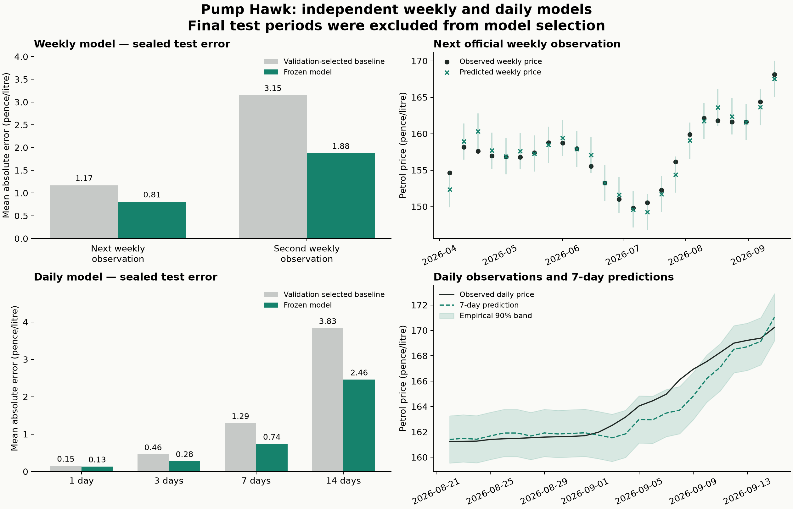

# Pump Hawk model training results

Completed 16 September 2026. **Both independent model families pass the provisional point-accuracy targets on validation and the sealed test periods.** The daily model's long-horizon uncertainty remains inadequately calibrated. The application still uses its existing heuristic; these are fitted research artifacts for a subsequent integration decision.

## Models and held-out accuracy

Errors are mean absolute error in **pence per litre**, not percentages. Baselines were chosen using validation, independently for each horizon, before the test was opened.

| Model / prediction                     | Test cases | Model MAE | Baseline MAE | Nominal 90% interval coverage |
| -------------------------------------- | ---------: | --------: | -----------: | ----------------------------: |
| Weekly: next official observation      |         24 |     0.811 |        1.171 |                         95.8% |
| Weekly: following official observation |         23 |     1.877 |        3.152 |                        100.0% |
| Daily: 1 day                           |         31 |     0.132 |        0.151 |                         93.5% |
| Daily: 3 days                          |         29 |     0.276 |        0.459 |                        100.0% |
| Daily: 7 days                          |         25 |     0.739 |        1.294 |                         92.0% |
| Daily: 14 days                         |         18 |     2.459 |        3.834 |                         55.6% |

The **weekly Huber regression** uses three retail-price lags and four B7H changes. Its average test MAE across the two horizons is 1.344 p/L versus 2.161 p/L: **37.8% lower**. Validation improvement was 25.16%. Adding Brent/FX or price-level features did not improve the selected weekly model sufficiently; the experiments retain those comparisons.

The **daily ridge regression** uses the last daily pump change, five- and fourteen-day pump slopes, B7H changes over 7/14/28 days, and Brent's seven-day change. It fits a separate direct regression for each day 1–14 using one common feature/regularisation specification. Average test MAE across days 1/3/7/14 is 0.902 p/L versus 1.434 p/L: **37.1% lower**. Validation improvement against the best baseline per horizon was 10.32% (10.71% against the strongest single baseline).

All daily labels are real reconstructed daily observations. **The weekly model produces only weekly observation forecasts. No weekly labels or weekly predictions enter the daily model.** Weekly horizons 7/14 are distances between official reference observations: with conservative Thursday issuance, the next Mondays are approximately 4/11 days after issuance. Daily origins and targets are 08:00 UTC snapshots, with literal 1–14-day horizons.

## Acceptance and why experimentation stopped

The numerical criteria were set before model experimentation:

- At least 10% lower mean MAE than the strongest validation-selected baseline across key horizons.
- No key horizon more than 5% worse than its baseline.
- Daily MAE at most 1 p at day 1, 1.5 p at day 3, 2 p at day 7 and 3 p at day 14; weekly thresholds 2 p/3 p for its next two observations.

Both models meet all three criteria on validation and test. Seven weekly candidates and eight daily candidates were examined through named, bounded hypotheses rather than a large parameter search. Initial pump-only regressions were insufficient; incorporating B7H movements provided useful additional information. Every candidate and fold result is retained in the experiment directories. Candidate selection was frozen before the parent opened the separate test periods.

The same frozen choices were then evaluated once on the sealed periods. No candidate was revised after seeing test results. Paired block-bootstrap test MAE-reduction intervals were positive: weekly approximately 0.506–1.107 p/L, daily 0.189–1.101 p/L. These resample observed periods; they do not establish performance under unobserved future market regimes. The daily validation improvement interval still crossed zero, which remains relevant evidence of limited stability.

## Important remaining limitation: daily uncertainty

The daily 14-day band, constructed from pre-test residuals for nominal 90% coverage, contained only 10 of 18 test outcomes (**55.6%**). Its test mean bias was −1.949 p/L and 90th-percentile absolute error 4.912 p/L. It underestimated the later rise. The calibration set had only 12 available 14-day labels after purging, and the test forecasts overlap substantially.

We therefore **accept the provisional point-forecast results, but do not accept the daily 14-day band as a calibrated 90% confidence range**. Other horizons' exact coverage is recorded in the JSON report. Exported artifacts label all bands as empirical and include their observed test coverage; they do not claim a guaranteed probability. Bands were not widened after inspecting the test to make the reported coverage look better.

The underlying constraint is the short daily archive, few independent changes of direction, and changing station coverage. More hyperparameter tuning on the same observations would not resolve that lack of evidence. Before presenting reliable long-horizon probabilities, obtain more comparable daily history or accrue a new prospective validation period. A new interval method can be developed using earlier validation folds, but its final assessment must use fresh untouched data. Point forecasts can be considered for a monitored pilot separately from that interval decision.

The weekly model also has exceptions: second-horizon validation error was 15.8% worse than momentum in 2023, despite improving overall. Its intervals are much wider at the second observation; high coverage does not imply precision. Neither model predicts an individual station's future price. The idealised buy-now/wait regret metrics are not a tank-use simulation or a promise of realised customer savings.

## Data acquired and reconstructed

| Input                                                                                             | Downloaded coverage / usable modelling coverage                                                                                                                                   |
| ------------------------------------------------------------------------------------------------- | --------------------------------------------------------------------------------------------------------------------------------------------------------------------------------- |
| [Official DESNZ petrol prices](https://www.gov.uk/government/statistics/weekly-road-fuel-prices)  | 1,215 weekly observations, 9 June 2003–14 September 2026; weekly feature/label frame begins January 2016                                                                          |
| [FuelCosts archived Fuel Finder prices](https://huggingface.co/datasets/jamesb7/fuel-prices-uk)   | Pinned revision `0549348f44d917e0fc94dead6a64677598736921`; 220 complete-date snapshots, 8 February–15 September 2026; daily modelling origins begin 8 March after feature warmup |
| [Databento historical statistics](https://databento.com/docs/schemas-and-data-formats/statistics) | B7H gasoline and BZ Brent, 2015–15 September 2026; calendar-ranked nearby outright contracts, final non-intraday settlements                                                      |
| [ECB reference rates](https://data.ecb.europa.eu/data/datasets/EXR)                               | GBP/EUR and USD/EUR from December 2014; GBP/USD calculated once from their ratio                                                                                                  |

Early 2015 futures statistics were predominantly weekly replay messages and stale at the weekly forecast origin. We kept that year as warmup and started weekly training in 2016. No current B7H/BZ signal is missing in the eligible daily or weekly frame. Same-contract lag completeness is documented separately in the agents' permitted-data audits.

Daily observations use one price per known eligible-location E10 station at 08:00 UTC. Availability is the later of archive receipt and source effective time. The reconstruction handles 8,202 future-source timestamp anomalies conservatively and ignores 966 stale source updates. It does not use current closure flags as if they were historical facts. Historical closures remain unknown, so this is an **equal-station observed-price proxy**, distinct from the official sales-weighted weekly benchmark and from exact live open-station membership. Fixed initial-cohort and fourteen-day-freshness sensitivity checks are retained.

The frozen data, hashes, exact query parameters and timestamps live in `.local/model-data/`. There are 277 verified compressed market files. Completed download requests were quoted at **$0.1623** total; all reserved estimates including rejected/interrupted attempts total **$0.2079**. These are metadata estimates, not a verified invoice. Every request was bounded by a cumulative $5 estimate cap; no subscription or licensing settings were changed.

## Evaluation discipline

| Model  | Validation                                | Calibration            | Sealed test              |
| ------ | ----------------------------------------- | ---------------------- | ------------------------ |
| Weekly | Expanding annual folds 2020–2025          | Jan–Mar 2026           | Apr–Sep 2026             |
| Daily  | Three expanding folds 15 May–19 July 2026 | 20 July–14 August 2026 | 15 August–September 2026 |

Training excludes outcomes unavailable at the fitting cutoff. Scalers and imputers fit inside each training fold. Futures definitions and settlement revisions are joined by availability; returns compare the same contract through rollovers, and FX never fills from the future. Historical government release vintages were unavailable: weekly data uses a conservative Thursday release assumption and today's revised CSV, a documented backtest limitation.

For the final evaluation, interval residuals come from calibration forecasts fitted before calibration; point-model coefficients are then refitted using labels available before the test starts. Consequently these are empirical residual intervals, not an exchangeability-based coverage guarantee. The tested coefficient snapshots are preserved, rather than silently replacing them with models fitted on their test outcomes.

## Deliverables and verification

- [Shared framework and commands](README.md), pinned Python dependencies and repeatable acquisition/preparation scripts.
- [Weekly model card](experiments/weekly/README.md), [daily model card](experiments/daily/RESULTS.md), all validation iterations and predictions.
- [Weekly held-out report](experiments/weekly/test-report.json) and [daily held-out report](experiments/daily/test-report.json).
- Portable fitted models: [weekly JSON](artifacts/weekly/model.json), [daily JSON](artifacts/daily/model.json). Trusted Python evaluation bundles are in `.local/model-artifacts/`.
- 9 tests cover outcome availability, frequency separation, station first-seen handling, timestamp anomalies, rollover consistency, future revisions, decision regret, block resampling and portable preprocessing. Every portable prediction matches the fitted pipeline: 47 weekly and 343 daily test predictions, with maximum discrepancies below `1e-10` p/L.
- Two **gpt-6-astra, xhigh** agents trained independently in separate temporary Git worktrees. Their changes are consolidated in the app's `ml/` directory; the parent performed the sealed evaluations. The temporary Git repository and worktrees were removed after consolidation. The application database, UI and active heuristic were not replaced.
